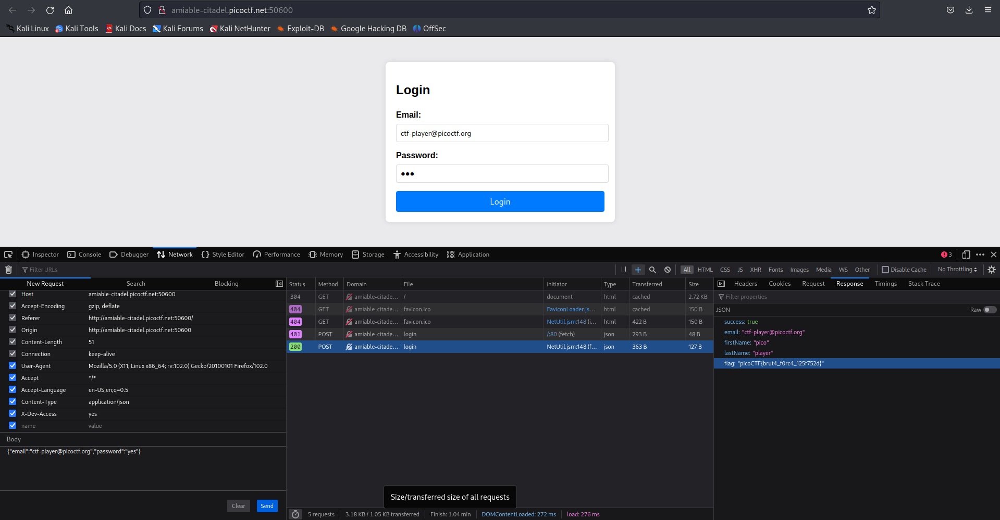

# TL;DR

Found a hidden ROT13 hint in the HTML comments suggesting a bypass header. By capturing a login request and resending it with the custom header `X-Dev-Access: yes`, I bypassed the password check and retrieved the flag from the server's JSON response.

**picoCTF{brut4_f0rc4_125f752d}**

# Challenge

[picoCTF - **Crack the Gate 1**](https://play.picoctf.org/practice/challenge/520) - We’re in the middle of an investigation. A person of interest is believed to be hiding sensitive data inside a restricted web portal. We have the email, but no password. Can you figure out the secret way in?

# What I needed

* **Browser:** Firefox (used for the "Edit and Resend" Network feature) or Chrome.
* **Tools:** Browser Developer Tools (Inspector/Network), [CyberChef](https://gchq.github.io/CyberChef/) (for ROT13).

# Summary (what you will do)

1. Access the challenge instance and inspect the source code.
2. Locate and decode a hidden ROT13 comment in the HTML.
3. Use the decoded hint to identify a "temporary bypass" header.
4. Capture a login attempt in the **Network** tab.
5. Manually inject the custom HTTP header and resend the request.
6. Extract the flag from the successful server response.


# Step-by-step walkthrough

## 1) Information Gathering

After launching the instance and navigating to the site, I opened the **Inspector** (`Ctrl+Shift+C`) to look at the HTML structure.

**Hidden Comment Found:**
Inside the `<body>` tag, I found a developer comment that appeared to be obfuscated.

## 2) Decoding the Hint (ROT13)

The string `Wnpx` and `urnqre` looked like **ROT13** (a simple substitution cipher where each letter is rotated 13 places in the alphabet).

1. Copy the comment text.
2. Paste it into **CyberChef**.
3. Apply the **ROT13** operation.

**Decoded Result:**
`NOTE: Jack - temporary bypass: use header "X-Dev-Access: yes"`

## 3) Capturing the Request

Now that I had the bypass header, I needed a way to send it to the server during the login process.

1. Open the **Network** tab in Developer Tools.
2. Enter the target email provided in the challenge description: `ctf-player@picoctf.org`.
3. Enter any random password (e.g., `ihaveanamazingday`).
4. Click **Login**.

The server initially returned a `401 Unauthorized` status because the password was incorrect.

## 4) Injecting the Bypass Header

To apply the developer's "temporary bypass," I needed to resend that exact request but with the secret header added.

1. Right-click the failed `POST /login` request in the Network tab.
2. Select **Edit and Resend** (in Firefox).
3. In the headers section, I added a new line:
   `X-Dev-Access: yes`.
4. Click **Send**.


## 5) Capturing the Flag

The second request returned a `200 OK` status. I clicked on the request and viewed the **Response** tab. The server responded with a JSON object containing the user's details and the hidden flag.

**JSON Response Body:**
```json
{
  "success": true,
  "email": "ctf-player@picoctf.org",
  "firstName": "pico",
  "lastName": "player",
  "flag": "picoCTF{brut4_f0rc4_125f752d}"
}
```

# Troubleshooting tips & explanations

## Why did this work?

This is an example of **Insecure Logic/Developer Backdoors**.

* **The Hint**: Developers sometimes leave "backdoors" or bypasses in the code for testing purposes. Leaving these in production—even if "hidden" in comments—is a major security risk.
* **The Header**: The server was configured to check for the existence of `X-Dev-Access: yes`. If present, it bypassed the password validation logic entirely.

## Failed to get the flag?

* **Header Syntax**: Ensure there are no spaces before the colon (e.g., `X-Dev-Access: yes` is correct).
* **ROT13 Accuracy**: Ensure you decoded the full string; if the header name is off by even one letter, the server will ignore it.



© 2025 Leander Steffan - CC BY 4.0.
Suggested attribution when reusing or quoting: Content by Leander Steffan - CC BY 4.0 - [https://github.com/LeanderSteffan/ctf-writeups](https://github.com/LeanderSteffan/ctf-writeups)
